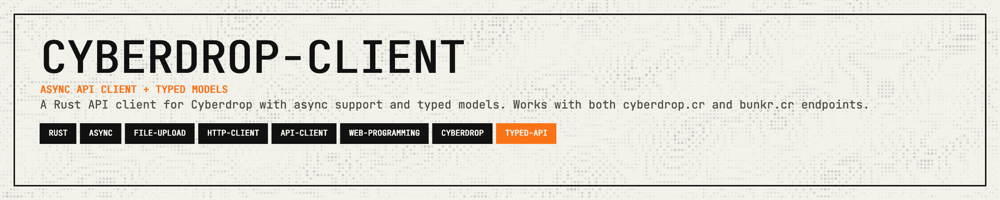

<p align="center">
  
</p>

<p align="center">
  <a href="https://crates.io/crates/cyberdrop-client"></a>
  <a href="https://docs.rs/cyberdrop-client"></a>
  <a href="https://opensource.org/licenses/MIT"></a>
  <a href="https://github.com/11philip22/cyberdrop-rs/pulls"></a>
</p>

<p align="center">
  <a href="#features">Features</a> · <a href="#installation">Installation</a> · <a href="#quick-start">Quick Start</a> · <a href="#examples">Examples</a> · <a href="#documentation">Documentation</a>
</p>

---

An async Rust client for the [Cyberdrop](https://cyberdrop.cr) API, built on [reqwest](https://github.com/seanmonstar/reqwest).

## Features

- **Authentication** — Login, register, and token verification with permission flags.
- **Album management** — List, create, and edit metadata/flags.
- **File listing** — Album file listing with built-in pagination (single page or all pages).
- **Uploads** — Automatic upload-node discovery, streaming for small files, chunked uploads for large files, and per-file progress callbacks.
- **Typed models** — Explicit error types for auth failures, album-not-found, album-exists, and missing fields.
- **Low-level access** — Optional raw `get` for endpoints not covered by higher-level methods.

## Installation

```toml
[dependencies]
cyberdrop-client = "0.4"
```

## Quick Start

```rust
use cyberdrop_client::CyberdropClient;
use std::path::Path;

#[tokio::main]
async fn main() -> Result<(), cyberdrop_client::CyberdropError> {
    let client = CyberdropClient::builder().build()?;
    let token = client.login("username", "password").await?;

    let authed = client.with_auth_token(token.into_string());
    let albums = authed.list_albums().await?;
    println!("albums: {}", albums.albums.len());

    let album_id = authed
        .create_album("my uploads", Some("created by cyberdrop-client"))
        .await?;
    let uploaded = authed
        .upload_file(Path::new("path/to/file.jpg"), Some(album_id))
        .await?;
    println!("uploaded {} -> {}", uploaded.name, uploaded.url);
    Ok(())
}
```

## Examples

Examples live in `examples/` and accept args or environment variables.

Environment variables used by most examples:
- `CYBERDROP_USERNAME`
- `CYBERDROP_PASSWORD`

```sh
cargo run --example register -- <username> <password>
cargo run --example login -- <username> <password>
cargo run --example list_albums -- <username> <password>
cargo run --example create_album -- <username> <password> "<name>" ["<description>"]
cargo run --example edit_album -- <username> <password> <album_id> ["<new_name>"] ["<new_identifier>"]
cargo run --example list_album_files -- <username> <password> <album_id> [page]
cargo run --example upload_file -- <username> <password> <path> [album_id]
```

## Documentation

For detailed API documentation, visit [docs.rs/cyberdrop-client](https://docs.rs/cyberdrop-client).

## Support

If this crate saves you time or helps your work, support is appreciated:

[](https://ko-fi.com/11philip22)
